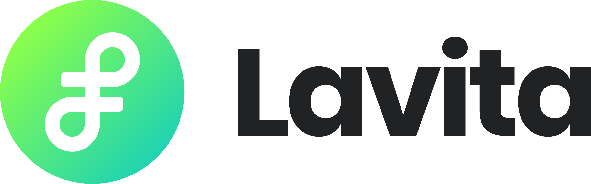

---
title: about
layout: default_2024
--- 

### Important Dates

| Event                                               | Date                                    |
| --------------------------------------------------- | --------------------------------------- |
| Submission deadline (both general and shared task)  | Thursday, Mar 21, 2024                  |
| Notification of acceptance                          | Friday, Apr 19, 2024                    |
| Final versions of papers due                        | Thursday, May 2, 2024                   |
| Workshop @ NAACL 2024                               | Thursday or Friday, June 20 or 21, 2023 |

All deadlines are 11:59PM UTC-12:00 ([anywhere on Earth](https://www.timeanddate.com/time/zones/aoe))

### Prior Events

For content from prior events, please see:

- [Clinical NLP 2023](https://clinical-nlp.github.io/2023/)
- [Clinical NLP 2022](https://clinical-nlp.github.io/2022/)
- [Clinical NLP 2020](https://clinical-nlp.github.io/2020/)
- [Clinical NLP 2019](https://clinical-nlp.github.io/2019/)
- [Clinical NLP 2016](https://clinical-nlp.github.io/2016/)

<!-- 
### Sponsors

    

    

          
    

    

 
-->
